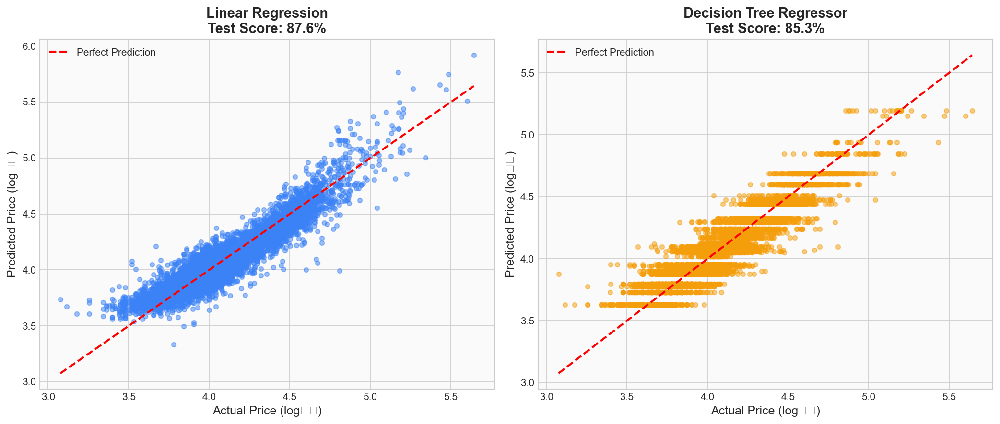
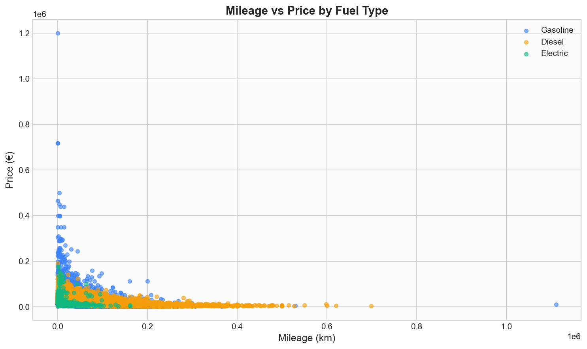
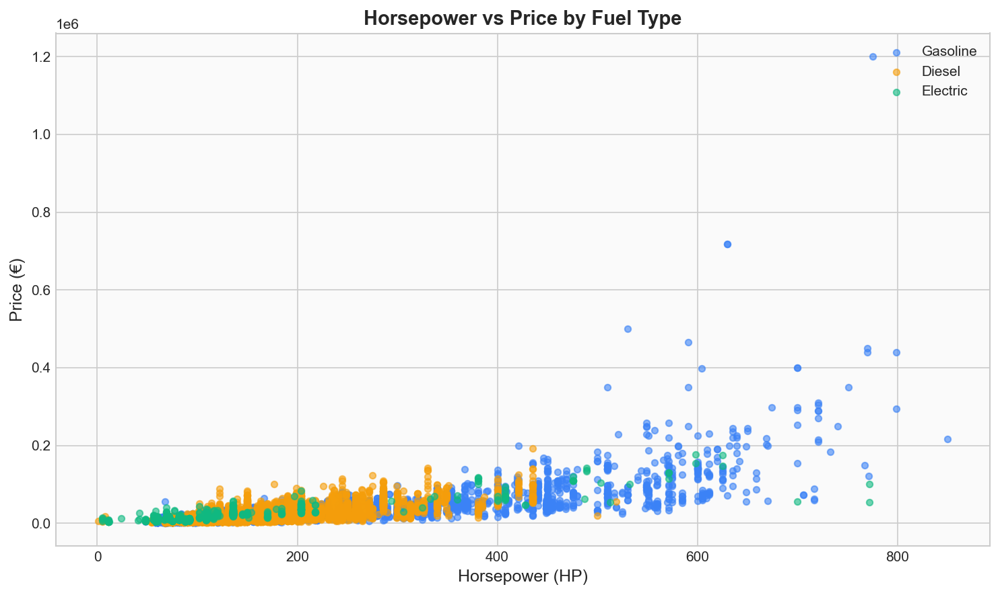
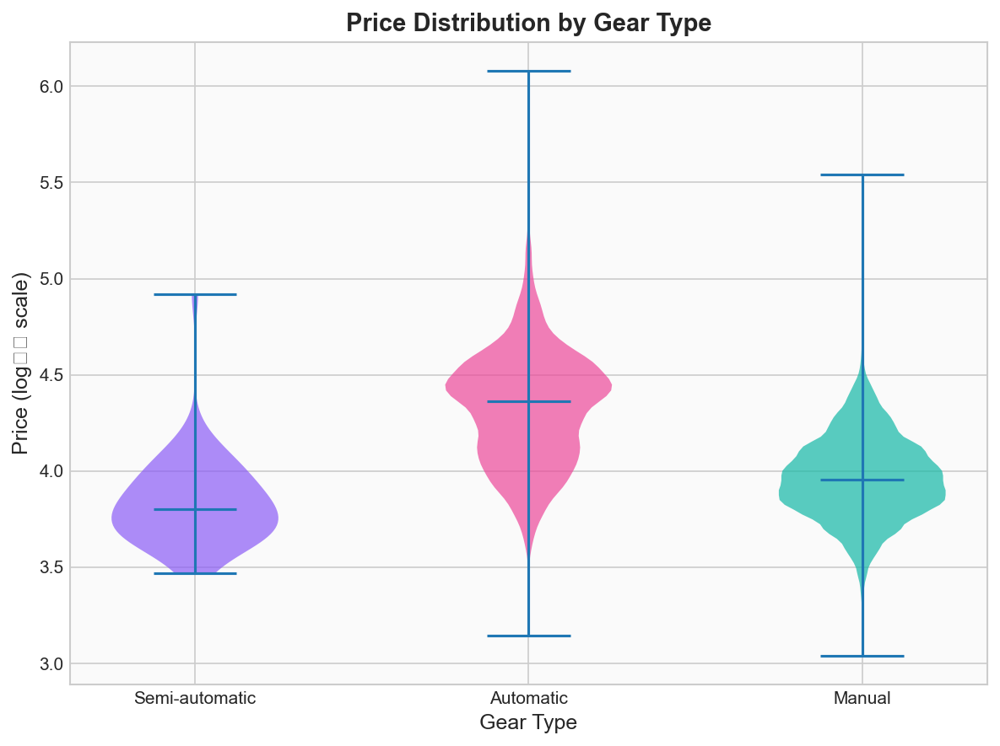
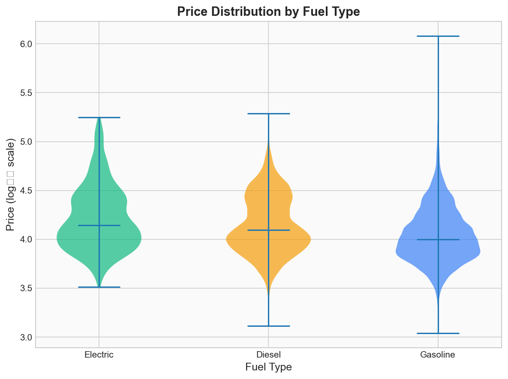

<p align="center">
  
</p>

<p align="center">
  <a href="https://www.python.org/"></a>
  <a href="https://scikit-learn.org/"></a>
  <a href="https://pandas.pydata.org/"></a>
  <a href="https://matplotlib.org/"></a>
</p>

---

## Overview

A machine learning project that predicts used car prices based on vehicle characteristics, achieving **87.6% accuracy** using Linear Regression with log-transformed target values. Built using a dataset of German used cars, this project explores relationships between mileage, horsepower, fuel type, gear type, and vehicle value.

---

## The Challenge

> **Research Question**: Can we build accurate predictive models for used car prices, and how do key features like fuel type, gear type, mileage, horsepower, and vehicle year relate to a car's value?

Used car pricing is complex, with values influenced by numerous interrelated factors. This project tackles the challenge of building interpretable models that can:
- Accurately predict resale prices from vehicle specifications
- Reveal which features most strongly influence car value
- Compare different ML approaches for regression tasks

---

## My Contributions

As the primary developer, I led the end-to-end implementation of this project:

### 1. Project Architecture & Setup
- Designed and initialized the repository structure
- Created the Jupyter notebook workflow for reproducible analysis
- Established data preprocessing pipeline

### 2. Machine Learning Implementation
- Built and evaluated **4 different models**:
  - Linear Regression (best performer: 87.6% test accuracy)
  - Decision Tree Regressor (85.3% test accuracy)
  - KNN Classifier for fuel type prediction
  - Decision Tree Classifier for fuel type prediction
- Implemented proper train/test splits with consistent random states

### 3. Key Discovery: Log Transformation
- Identified that price data was heavily right-skewed
- Implemented **log10 transformation** on the target variable
- **Result: +10% improvement in model accuracy** (from ~73% to 87.6%)

### 4. Data Visualization
- Created exploratory scatter plots revealing price relationships
- Built violin plots for categorical feature analysis
- Designed model comparison visualizations

### 5. Feature Engineering
- Developed numerical encoding schemes for categorical variables
- Created meaningful feature representations for gear type, fuel type, and offer type

---

## Key Results

### Model Performance

| Model | Target | Training Score | Testing Score |
|-------|--------|----------------|---------------|
| **Linear Regression** | Price (log10) | 87.2% | **87.6%** |
| Decision Tree Regressor | Price (log10) | 85.4% | 85.3% |
| KNN Classifier | Fuel Type | 82.8% | 76.1% |
| Decision Tree Classifier | Fuel Type | 99.9% | 82.5% |

### Model Comparison

<p align="center">
  
</p>
<p align="center"><em>Predicted vs Actual price comparison showing Linear Regression's superior generalization</em></p>

---

## Exploratory Analysis

### Price by Vehicle Characteristics

<p align="center">
  
</p>
<p align="center"><em>Lower mileage strongly correlates with higher prices across all fuel types</em></p>

<p align="center">
  
</p>
<p align="center"><em>Higher horsepower vehicles command premium prices, especially gasoline cars</em></p>

### Price Distributions

<p align="center">
  
</p>
<p align="center"><em>Automatic transmission vehicles are consistently the most expensive</em></p>

<p align="center">
  
</p>
<p align="center"><em>Electric vehicles show higher median prices with tighter distribution</em></p>

---

## Technical Highlights

| Aspect | Details |
|--------|---------|
| **Languages** | Python 3.x |
| **ML Framework** | scikit-learn |
| **Data Processing** | Pandas, NumPy |
| **Visualization** | Matplotlib |
| **Key Technique** | Log transformation for skewed target |
| **Validation** | 80/20 train-test split |

### ML Pipeline Architecture

```
Raw Data (CSV)
     │
     ▼
┌─────────────────────────────────┐
│     Data Preprocessing          │
│  • Remove missing values        │
│  • Filter fuel types            │
│  • Numerical encoding           │
└─────────────────────────────────┘
     │
     ▼
┌─────────────────────────────────┐
│   Feature Engineering           │
│  • Log10 price transformation   │
│  • Categorical encoding         │
└─────────────────────────────────┘
     │
     ▼
┌─────────────────────────────────┐
│    Model Training               │
│  • Train/Test Split (80/20)     │
│  • Linear Regression            │
│  • Decision Tree Regressor      │
└─────────────────────────────────┘
     │
     ▼
┌─────────────────────────────────┐
│    Evaluation & Comparison      │
│  • R² Score                     │
│  • Predicted vs Actual plots    │
└─────────────────────────────────┘
```

---

## Key Findings

1. **Log transformation is crucial** — Transforming price to log10 scale improved model accuracy by over 10 percentage points

2. **Linear Regression outperforms Decision Tree** — Simpler model showed better generalization with minimal gap between training and testing scores

3. **Automatic transmission = Higher price** — Gear type is a strong predictor, with automatic cars commanding the highest prices

4. **Inverse mileage-price relationship** — Clear negative correlation between mileage and resale value

5. **Horsepower drives premium pricing** — Strong positive correlation, especially for gasoline vehicles

---

## Academic Context

This project was developed for **INFO 1998: Introduction to Machine Learning** at **Cornell University** (Spring 2025).

**Team**: Shawn Zou (Lead Developer), Angel Gomez

**Dataset**: [Cars Germany - Kaggle](https://www.kaggle.com/datasets/ander289386/cars-germany)

---

## About the Contributor

**Shawn Zou** · Cornell University

Machine learning enthusiast with interests in predictive modeling and data-driven insights. This project demonstrates proficiency in:
- End-to-end ML pipeline development
- Data preprocessing and feature engineering
- Model selection and optimization
- Technical communication and visualization

---

*Note: In accordance with Cornell University's Academic Integrity Policy and research guidelines, source code is not publicly available. This repository showcases the project's methodology and results.*
